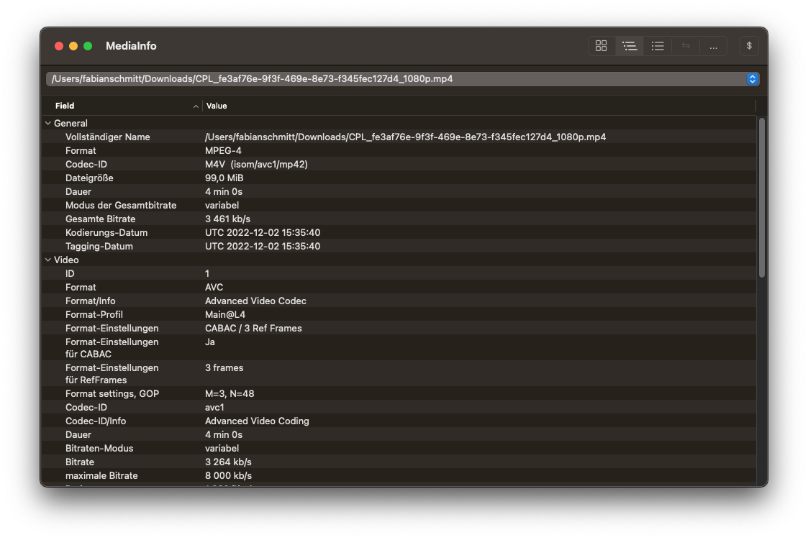

---
layout: default
title: Download
---

# Download

Ist die Quelldatei fertig transcodiert, werden die resultierenden Dateien im eigenen Bucket angezeigt und können über die S3-Weboberfläche heruntergeladen werden.

## Inspektion

Zur Kontrolle, ob alle Codierungsparameter berücksichtigt wurden, lässt sich die Datei in MediaInfo öffnen. MediaInfo zeigt detailliert Eigenschaften und Metadaten für vielerlei verschiedene Medien an. 

Schon die Übersicht zeigt die Videodatenrate und die Audiodatenrate. Ebenso werden die verwendeten Audio- und Video-Codecs angezeigt. In anderen Ansichten wie die "Tree"-Ansicht sind auch tiefer gehende Eigenschaften wie Farbraum und Chroma-Subsampling aufgelistet.

Frage 4

Welche Codierungsparameter wurden von **AWS MediaConvert** für die verschiedenen Formate gewählt?  
Geben Sie die Parameter in einer Tabelle mit der folgenden Form an:

    | Parameter            | `_1080p` | `_720p` | `_480p` |
    | -------------------- | -------- | ------- | ------- |
    | Container-Format     |          |         |         |
    | Gesamtbitrate        |          |         |         |
    | Video-Codec          |          |         |         |
    | Codec-Profil / Level |          |         |         |
    | Video-Bitrate        |          |         |         |
    | Auflösung (b x h)    |          |         |         |
    | Chroma-Subsampling   |          |         |         |
    | Farbtiefe            |          |         |         |
    | Primärvalenzen       |          |         |         |
    | Audio-Codec          |          |         |         |
    | Audio-Bitrate        |          |         |         |

---

⬅️ **Vorheriges Kapitel:**  
[Transcodierung](03-transcoder.md)

➡️ **Nächstes Kapitel:**  
[Fazit](05-fazit.md)
