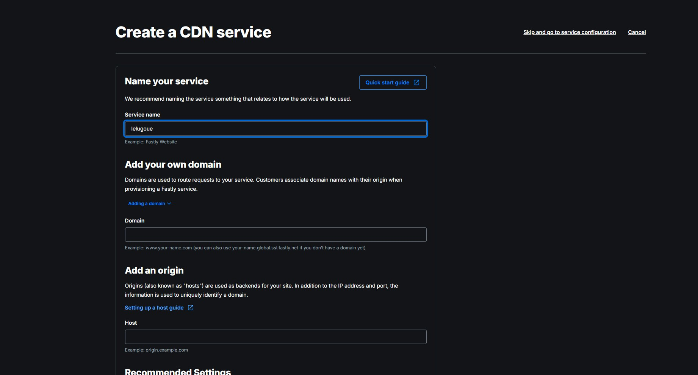
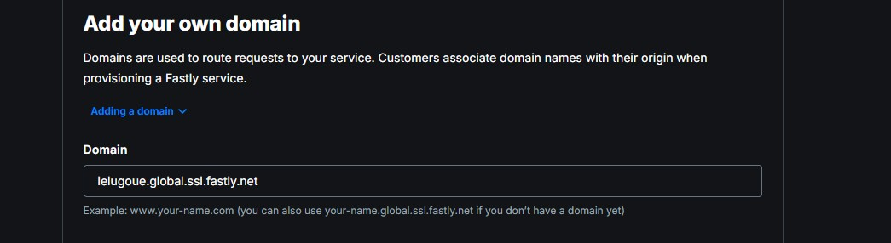
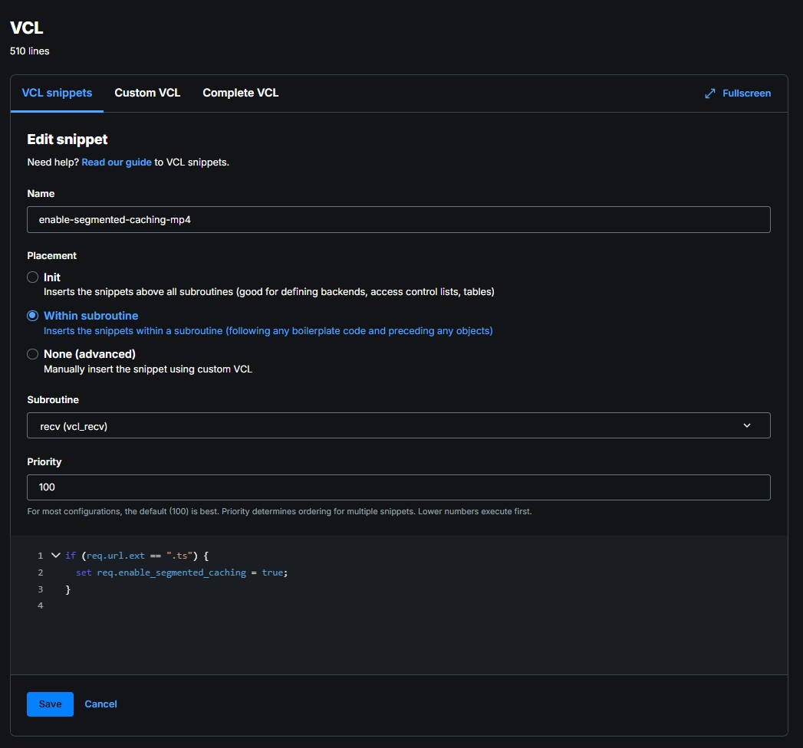

## Service

Jeder Studierende erstellt einen eigenen **Fastly Service**.  
Ein Service beschreibt die vollständige Konfiguration des CDNs und legt fest,
wie Fastly auf eingehende Anfragen reagiert und von welchem Origin Inhalte
abgerufen werden.

### Service anlegen

Nach dem Login in das Fastly Dashboard wird in der linken Seitenleiste der Punkt  
**Compute & CDN → CDN** ausgewählt.

Auf der Übersichtsseite werden alle vorhandenen Services angezeigt.

Zum Erstellen eines neuen Services wird rechts oben auf **Create service**
geklickt.


### Name

Im ersten Schritt wird der Name des Services festgelegt.  
Als Name soll der **HDS-Anmeldename also der Name mit dem Sie sich bei StudIP auch anmelden** verwendet werden (z. B. `lelugoue`).

Der Name dient ausschließlich der internen Zuordnung und hat keinen Einfluss
auf die später verwendete Domain.



### Domain

Im nächsten Schritt müssen die Domains definiert werden, unter denen die Inhalte
über das CDN erreichbar sind.

Jeder Studierende erhält eine eigene Domain von Fastly.  
Diese Domain wird automatisch von Fastly bereitgestellt und besitzt die Form:

<service-name>.global.ssl.fastly.net


**Diesen Namen erhalten Sie aus der bereitgestellten Mail.**

Diese Domain wird später zur Auslieferung der Mediendateien genutzt.




### Segmentiertes Caching aktivieren

### VLC Anpassungen

Bei der Auslieferung großer Videodateien aus dem STACKIT Object Storage über Fastly stößt die Standardkonfiguration schnell an Grenzen. Für neue Fastly-Accounts dürfen Objekte ohne Zusatzfunktionen nur bis zu einer Größe von 20 MB im Cache gespeichert werden. Das verwendete Testvideo (testvideo.mp4) ist deutlich größer, weshalb ein normaler Cache-Zugriff zu einer Fehlermeldung („Response object too large“) führt.

Um solche Dateien trotzdem performant über das CDN ausliefern zu können, bietet Fastly Segmented Caching an. Dabei wird das Video nicht als einzelne große Datei im Cache abgelegt, sondern in kleinere Abschnitte zerlegt. Diese Segmente lassen sich unabhängig voneinander zwischenspeichern und bei Bedarf wieder zusammensetzen. Das passt gut zu typischen Videoabrufen, da moderne Mediaplayer Inhalte ohnehin in Form von Byte-Range-Anfragen anfordern.

Segmented Caching ist standardmäßig nicht aktiv und muss gezielt konfiguriert werden.

Navigieren Sie unter **LOGGING** zu dem Reiter Snippets


Übergeben Sie auf der Einrichtungsmaske folgende Parameter:

**Name:** enable-segmented-caching.mp4
**Placement:** Within subroutine
**Subroutine:** recv(vcl_recv)
**Priority:** 100
```bash
if (req.url.ext == ".ts") {
  set req.enable_segmented_caching = true;
}
```




### Origin

Als Nächstes muss der **Origin-Server** konfiguriert werden.  
Der Origin ist die Quelle, von der Fastly die Mediendateien bezieht, falls diese
noch nicht im Cache vorhanden sind.

In diesem Versuch wird ein **AWS-S3-Bucket** als Origin verwendet.

```bash
mvs-<StudIpUser>.s3.eu-central-1.amazonaws.com
```

### Aktivierung

Nach der Aktivierung ist der Service aktiv und die Inhalte können über die
zugewiesene Domain abgerufen werden.

Änderungen an der Konfiguration wirken sich nach der
Aktivierung direkt auf den Service aus.

### Edge Hostname

Der Edge Hostname bezeichnet den von Fastly bereitgestellten Hostnamen, über den Inhalte über das CDN ausgeliefert werden.
Er dient als technischer Endpunkt, über den Anfragen an die Edge-Server von Fastly gestellt werden und über den die Mediendateien abgerufen werden können.

In der Praxis verweist ein DNS-Eintrag einer eigenen Domain oder Subdomain auf diesen Edge Hostnamen.
Da für diesen Versuch keine eigene Domain zur Verfügung steht, erfolgt der Zugriff direkt über den von Fastly bereitgestellten Edge Hostnamen.

### Settings / Konfigurationslogik

ie Service-Konfiguration legt fest, wie Fastly auf eingehende Anfragen reagiert.
Vergleichbar mit den Property Rules bei Akamai wird die Anfrage anhand definierter Regeln verarbeitet.

Für diesen Versuch wird ausschließlich die automatisch angelegte Default Configuration verwendet und gezielt angepasst.
Weitere Regeln sind nicht erforderlich, da ausschließlich VOD-Inhalte (HLS) ausgeliefert werden.
