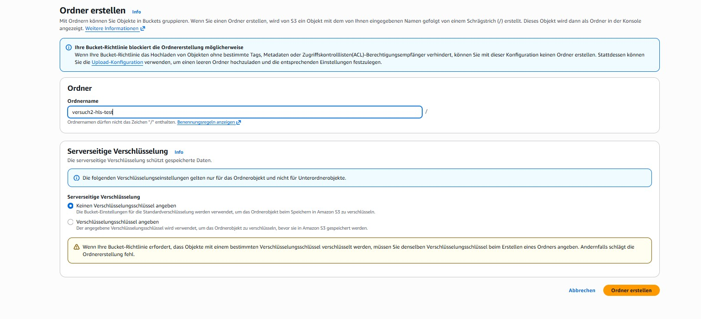

# Origin (AWS S3)

Wie in den Service-Einstellungen bereits festgelegt, sollen die Quelldaten der Mediendateien von einem AWS S3 Origin abgerufen werden.
Für jeden Teilnehmenden der AWS-Übung steht ein eigener Bucket bzw. ein eigener Namensbereich innerhalb eines Buckets zur Verfügung.

Die in Versuch 2 verwendeten HLS-Streaming-Inhalte liegen initial in einem gemeinsamen Source-Bucket, der allen Studierenden lesend zur Verfügung steht.
Dieser Bucket enthält vorbereitete Beispielclips und dient als Ausgangspunkt für den Versuch.

Die eigenen Buckets der Studierenden werden im weiteren Verlauf gezielt befüllt und dienen anschließend als persönlicher Origin für das CDN.

## Zugriff

Auf den AWS-S3-Origin kann auf verschiedenen Wegen zugegriffen werden, unter anderem über HTTP(S) oder die AWS-API.

Für diesen Versuch wird der Zugriff über die AWS Management Console genutzt, da diese eine einfache und übersichtliche Kontrolle der im Bucket gespeicherten Dateien ermöglicht.

Zur Übersicht der Buckets wechseln Sie in der AWS-Konsole zum Diens


## S3-Bucket-Übersicht

Auf der Startseite des S3-Dienstes werden alle verfügbaren Buckets angezeigt.
Diese dienen als logische Container für Objekte und strukturieren die gespeicherten Inhalte.

Öffnen Sie zunächst den für **Sie vorgesehenen eigenen Bucket.**
Jeder Studierende arbeitet ausschließlich in seinem eigenen Bucket bzw. Verzeichnisbereich.

## Inhalte im Source-Bucket (a--sourcefiles)
Im Source-Bucket befinden sich die für das Streaming benötigten Dateien.
Für Versuch 2 sind dort bereits HLS-Streaming-Inhalte abgelegt.

Typischerweise umfasst dies:

eine Master-Manifest-Datei (*.m3u8)

mehrere Variant-Manifeste für unterschiedliche Qualitätsstufen

zugehörige Segment-Dateien (*.ts)

Diese Dateien bilden gemeinsam den vollständigen Streaming-Clip und dienen als Grundlage für die spätere Auslieferung über das CDN.

Navigieren Sie hierzu in der S3-Übersicht in den Bucket a--sourcefiles und öffnen Sie anschließend den Ordner ftp_source/.
Sie sollten dort eine Dateiansicht wie in der folgenden Abbildung sehen.


## Kontrolle der Inhalte

Verschaffen Sie sich einen Überblick über die im Source-Bucket vorhandenen Dateien.
Achten Sie dabei insbesondere auf die vorhandenen Manifest-Dateien (*.m3u8), da diese die Struktur des Streams beschreiben.

<div style="border: 2px solid #ffffff; padding: 14px; border-radius: 6px; margin: 14px 0;"> <span style="color:cyan; font-weight:bold; font-size:1.2em;"> Frage 4 </span><br><br>

Dokumentieren Sie, welche <b>Manifest-Dateien (*.m3u8)</b> für den gesamten Clip
sowie für die einzelnen Qualitätsstufen im Source-Bucket vorhanden sind.

<br><br>
Gehen Sie dabei insbesondere auf folgende Punkte ein:

<ul> <li>welche Manifest-Dateien existieren</li> <li>welche Funktion die einzelnen Manifeste innerhalb des HLS-Streams übernehmen</li> </ul> </div>

## Anlegen eines Test-Unterordners im eigenen Bucket


Damit die Inhalte aus Versuch 2 klar von späteren Versuchen (z. B. MediaConvert-Outputs) getrennt sind, wird im eigenen Bucket ein separater Unterordner angelegt.

Vorgehen

1. Wechseln Sie zurück in Ihren eigenen Studierenden-Bucket.

2. Klicken Sie oben rechts auf „Ordner erstellen“.


3. Vergeben Sie folgenden Ordnernamen 

```bash
versuch2-hls-test
```
4. Bestätigen Sie die Erstellung des Ordners.

Dieser Ordner dient ausschließlich als Origin-Verzeichnis für Versuch 2.





## Kopieren der HLS-Testdaten in den eigenen Bucket

Kopieren Sie nun die Dateien des HLS-Testclips aus dem Source-Bucket in den soeben angelegten Unterordner.

**Vorgehen**

1. Öffnen Sie im Source-Bucket den Ordner ftp_source/.

2. Markieren Sie alle Dateien des Testclips, also:

    - die Master-Playlist (dolby_countdown.m3u8)
    - alle Variant-Playlists (*_SD.m3u8, *_HD.m3u8, *_FHD.m3u8)
    - alle zugehörigen Segment-Dateien (*.ts)


3. Wählen Sie im Menü „Aktionen → Kopieren“.

4. Navigieren Sie als Ziel zu Ihrem eigenen Bucket in den Ordner:


```bash
/versuch2-hls-test/
```

5. Bestätigen Sie den Kopiervorgang.

**Nach Abschluss befinden sich alle für den HLS-Stream benötigten Dateien im eigenen Bucket und können von dort korrekt über das CDN ausgeliefert werden.**
