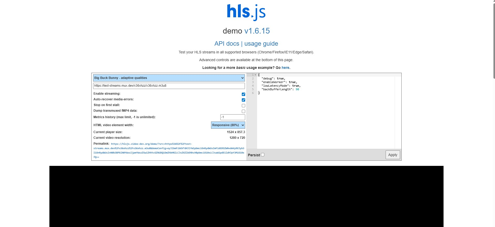

# Inhalte Abrufen

Die Inhalte sind nun über das CDN erreichbar.
Der HLS-Stream wird über den Fastly Edge Hostnamen ausgeliefert.

**Ziel dieses Abschnitts ist es:**

- die korrekte Wiedergabe des HLS-Streams zu überprüfen

- die Umschaltung zwischen verschiedenen Qualitätsstufen zu testen

- das Verhalten der DNS-Auflösung über das CDN zu analysieren

## HLS-Player

Zum Testen der HLS-Wiedergabe wird die Demo-Instanz von hls.js verwendet.

**Der Demo-Player ist unter folgender Adresse erreichbar:**

https://hlsjs.video-dev.org/demo/





### ⚠️ Wichtiger Hinweis zu CORS (zwingend erforderlich) ⚠️

Der hls.js-Demo-Player wird von einer anderen Domain geladen als der HLS-Stream.
Dadurch greift im Browser die Same-Origin-Policy, was ohne zusätzliche Maßnahmen dazu führt, dass:

- das Manifest geladen wird

- die Segment-Dateien jedoch blockiert werden

- die Wiedergabe fehlschlägt (manifestLoadError, levelLoadError)

**Lösung: CORS-Browser-Extension**

Für diesen Versuch ist die Verwendung einer CORS-Browser-Extension erforderlich und erlaubt.

**Installieren Sie die Extension über den jeweiligen Browser-Store.**

https://chromewebstore.google.com/detail/allow-cors-access-control/lhobafahddgcelffkeicbaginigeejlf

**Wenn dies erfolgt ist kann nun das Plugin aktiviert werden, hierfür muss auf das Puzzlestück in Chrome gedrückt werden und auf das Corsplugin navigiert werden**


**Nun auf Toggle ON OFF drücken. Das PlugIn ist somit aktiviert**


## Wiedergabe-URL einfügen

Nach der Aktivierung der CORS-Extension kann der HLS-Stream im hls.js-Player getestet werden.

1. Wechseln Sie zurück zur hls.js-Demo-Seite:

    https://hlsjs.video-dev.org/demo/

2. Ersetzen Sie die im Player voreingetragene Beispiel-URL durch die Fastly-URL der Master-Playlist.


**Struktur der URL**

**Die URL besteht aus:**

- dem Fastly Edge Hostnamen
- dem Pfad zur HLS-Playlist im Source-Bucket


```bash
https://<FASTLY-EDGE-HOSTNAME>/<PFAD-ZUM-HLS-ORDNER>/dolby_countdown.m3u8
```
**Beispiel:**

```bash
https://lelugoue.global.ssl.fastly.net/versuch2-hls-test/dolby_countdown.m3u8
```

3. Bestätigen Sie die URL mit Enter.
 
 **Das Video sollte daraufhin automatisch angangen abzuspielen:**


 


### DNS-Auflösung (Fastly)

Nachdem die Wiedergabe erfolgreich getestet wurde, soll nun überprüft werden,
wie der Fastly-Hostname per DNS aufgelöst wird.


**nslookup (lokal)**

Öffnen Sie ein Terminal bzw. eine Kommandozeile und führen Sie folgenden Befehl aus:

```bash
nslookup <service-name>.global.ssl.fastly.net
```

**Beispiel:**

```bash
nslookup lelugoue.global.ssl.fastly.net
```

Im oberen Bereich wird der verwendete DNS-Server angezeigt.
Darunter erscheinen die IP-Adressen, auf die der Fastly-Hostname aufgelöst wird


<div style="border: 2px solid #ffffff; padding: 14px; border-radius: 6px; margin: 14px 0;">
  <span style="color:cyan; font-weight:bold; font-size:1.2em;">
    Frage 6
  </span><br><br>

  Führen Sie den Befehl <b>nslookup</b> in der Hochschule aus und verwenden Sie dabei
  den Fastly-Edge-Hostnamen Ihres Services.

  <br><br>
  Fügen Sie einen <b>Screenshot der Konsolenausgabe</b> in Ihren Versuchsbericht ein.

  <br><br>
  Recherchieren Sie anschließend mithilfe einer GeoIP-Webseite
  (z.&nbsp;B. <a href="https://www.maxmind.com/en/geoip-demo" target="_blank">https://www.maxmind.com/en/geoip-demo</a>)
  den ungefähren <b>Standort</b> und den <b>Betreiber</b> der aufgelösten IP-Adressen.

  <br><br>
  Falls der Versuch nicht in der Hochschule durchgeführt wird, geben Sie im Bericht
  die <b>Stadt</b> an, in der der Befehl ausgeführt wurde.
</div>


