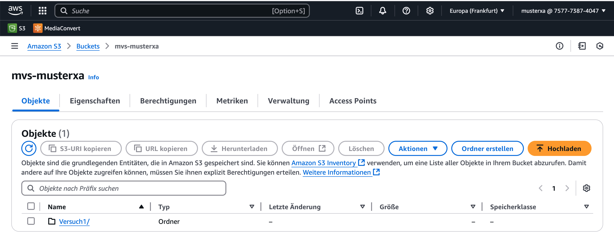
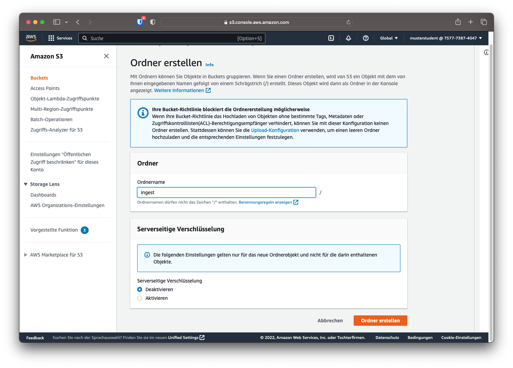
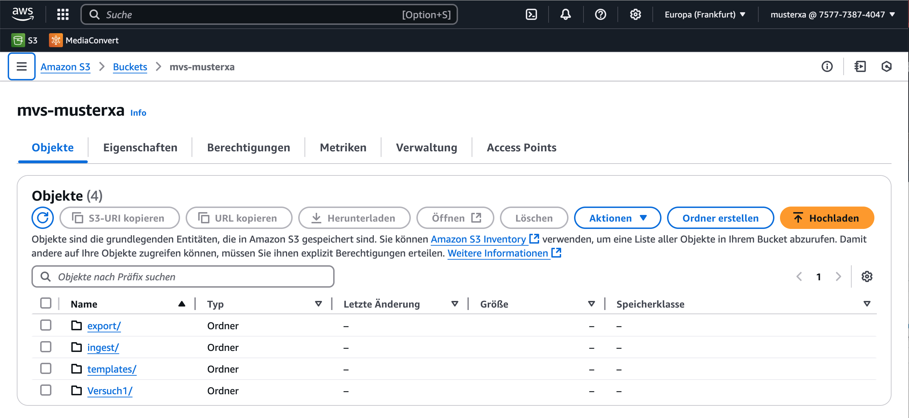
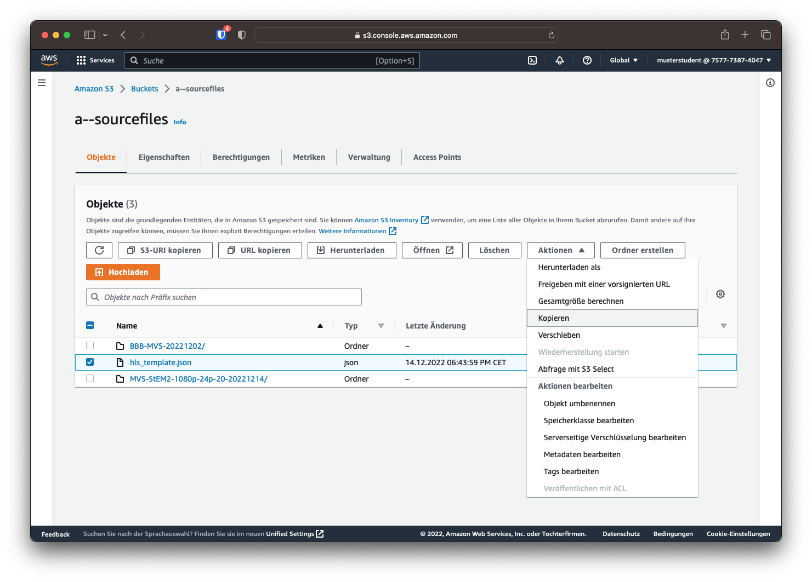
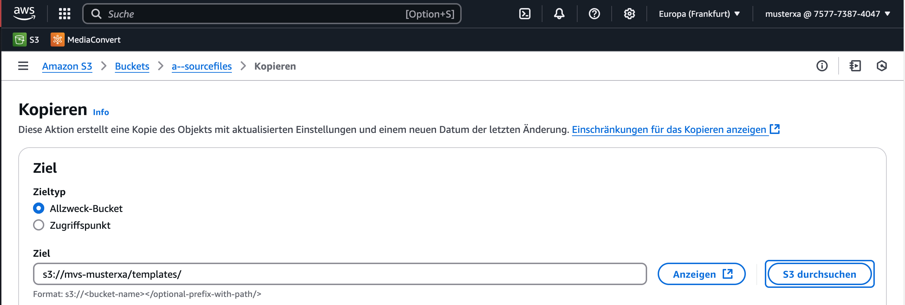

## S3-Vorbereitungen

Für diesen Versuch werden mehrere Unterordner im bereits vorhandenen
AWS-S3-Bucket benötigt. Diese dienen der strukturierten Abbildung des
automatisierten Transcoding-Workflows.

Es werden folgende Ordner angelegt:

- **ingest/**  
  Ablageort für neu hochgeladene Quelldateien.  
  Das Ablegen einer Datei in diesem Ordner löst die erste Lambda-Funktion aus.

- **export/**  
  Zielordner für die von AWS MediaConvert erzeugten HLS-Streaming-Dateien.  
  Dieser Ordner dient anschließend als **Origin für das Fastly CDN**.

- **templates/**  
  Enthält JSON-Vorlagen mit Transcodier-Parametern für MediaConvert.

## Unterordner erstellen

**Um den Unterordner zu erstellen, muss auf der AWS Weboberfläche der entsprechende Bucket geöffnet werden und über den Button "Ordner erstellen" erstellt werden.**

**Außer dem Ordnername müssen keine weiteren Einstellungen bei der Erstellung festgelegt werden.**

**Wiederholen Sie den Vorgang, bis alle drei Ordner erstellt sind.**

## Transcodiervorlage hinzufügen

Für die automatische Transcodierung muss MediaConvert mitgeteilt werden, welche Transcodierparameter gewählt werden sollen. Dies geschieht über eine Vorlage im JSON-Format. Ein Beispiel für diese Vorlage steht in `a--sourcefiles` zur Verfügung und soll in den Ordner `templates` kopiert werden.

Frage 5

Laden Sie die JSON-Vorlage herunter und öffnen Sie diese in einem Texteditor.  
Welche **Auflösungen** werden durch diese Vorlage erzeugt?  
Welche **durchschnittlichen und maximalen Video-Bitraten** besitzen die Auflösungen jeweils?

Kontrollieren Sie, dass die Datei in das richtige Verzeichnis kopiert wurde.

---

⬅️ **Vorheriges Kapitel:**  
[Einführung](01-einfuehrung.md)

➡️ **Nächstes Kapitel:**  
[SNS](03-sns.md)
